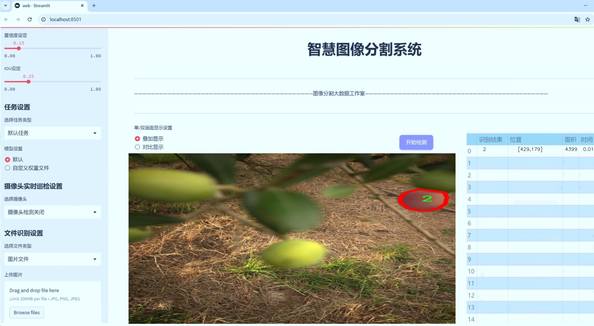
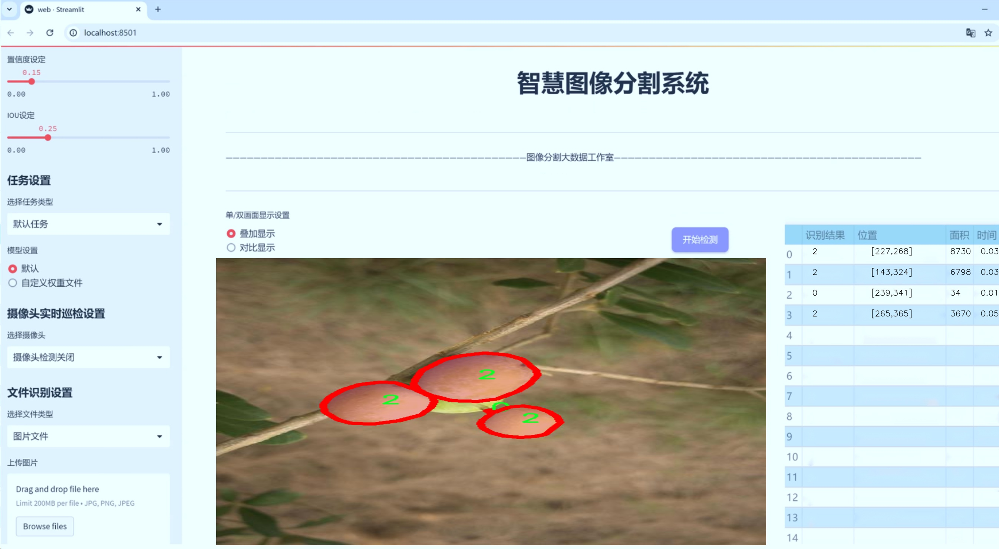
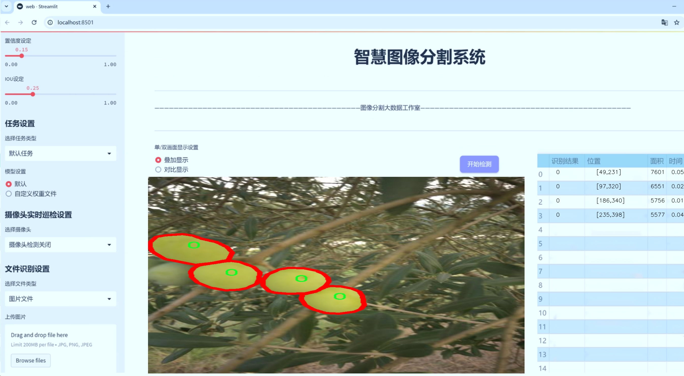
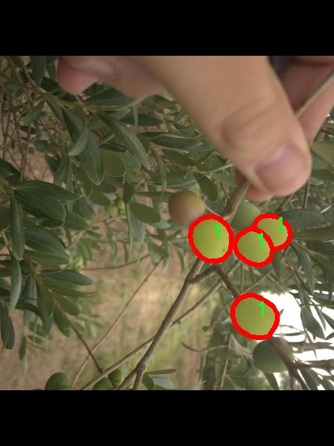
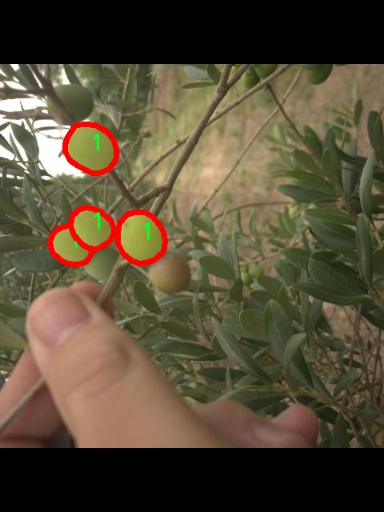
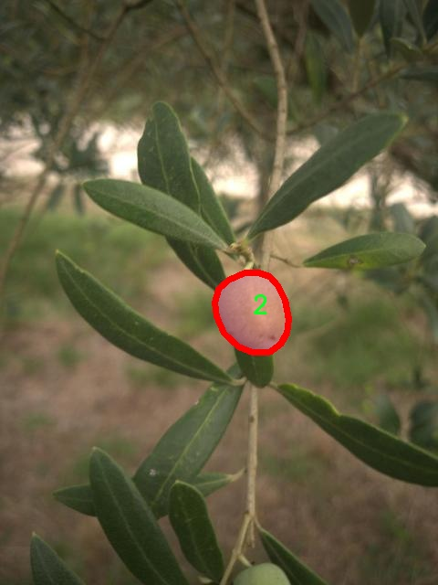
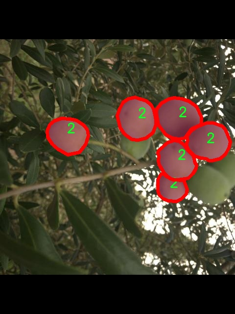
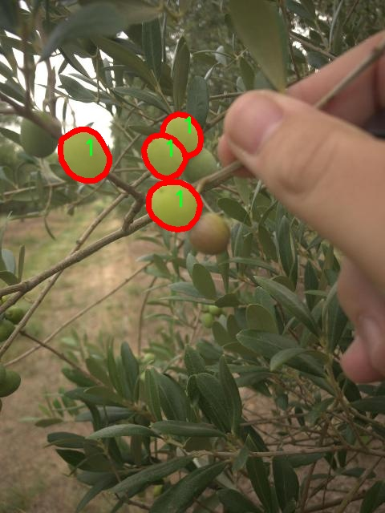

# 枣子颜色分级图像分割系统： yolov8-seg-RevCol

### 1.研究背景与意义

[参考博客](https://gitee.com/YOLOv8_YOLOv11_Segmentation_Studio/projects)

[博客来源](https://kdocs.cn/l/cszuIiCKVNis)

研究背景与意义

随着农业现代化的不断推进，果品的质量控制和分级管理日益受到重视。尤其是在干果产业中，枣子作为一种重要的经济作物，其市场需求逐年上升，如何有效地对枣子的颜色进行分级，以确保产品的质量和市场竞争力，成为了亟待解决的问题。传统的枣子分级方法主要依赖人工经验，不仅效率低下，而且容易受到主观因素的影响，导致分级结果的不一致性和不准确性。因此，开发一种高效、准确的自动化分级系统显得尤为重要。

近年来，深度学习技术的快速发展为图像处理和分析提供了新的解决方案。YOLO（You Only Look Once）系列模型因其高效的实时目标检测能力，逐渐成为计算机视觉领域的研究热点。特别是YOLOv8及其改进版本，凭借其在速度和精度上的优越表现，已被广泛应用于各种图像分割任务中。通过对YOLOv8模型的改进，可以进一步提升其在枣子颜色分级中的应用效果，实现更为精准的图像分割和分类。

本研究基于改进YOLOv8模型，构建一个枣子颜色分级图像分割系统，旨在通过自动化手段提高枣子分级的效率和准确性。我们使用的数据集包含2300张图像，涵盖了7个不同的颜色类别，这为模型的训练和验证提供了丰富的样本基础。通过对这些图像进行实例分割，系统能够识别并分类不同颜色的枣子，从而实现精准的分级。这不仅可以减少人工操作的时间和成本，还能提高分级的标准化程度，确保产品质量的一致性。

此外，随着消费者对食品安全和质量要求的提高，果品的分级标准化也愈发重要。基于改进YOLOv8的图像分割系统，不仅能够满足市场对高质量枣子的需求，还能为果品行业的标准化管理提供技术支持。通过数据驱动的方式，系统能够实时监测和评估枣子的颜色变化，及时调整分级策略，从而提升整体的生产效率和市场竞争力。

综上所述，本研究的意义在于通过引入先进的深度学习技术，推动枣子分级的自动化和智能化进程，为果品行业的可持续发展提供新的思路和方法。同时，该系统的成功应用将为其他农产品的分级管理提供借鉴，促进农业生产的现代化和智能化转型。通过对枣子颜色分级的深入研究，我们希望能够为相关领域的学术研究和实际应用提供有价值的参考，推动农业科技的进步与发展。

### 2.图片演示







注意：本项目提供完整的训练源码数据集和训练教程,由于此博客编辑较早,暂不提供权重文件（best.pt）,需要按照6.训练教程进行训练后实现上图效果。

### 3.视频演示

[3.1 视频演示](https://www.bilibili.com/video/BV1wgUHY4Ez1/)

### 4.数据集信息

##### 4.1 数据集类别数＆类别名

nc: 7
names: ['0', '1', '2', '3', '4', '5', '6']


##### 4.2 数据集信息简介

数据集信息展示

在本研究中，我们使用了名为“base_truck_seg”的数据集，以支持改进YOLOv8-seg的枣子颜色分级图像分割系统的训练和验证。该数据集的设计旨在提供多样化的图像样本，以确保模型能够在不同的环境和条件下有效地进行颜色分级和图像分割。数据集包含了七个不同的类别，分别用数字“0”到“6”进行标识，这些类别代表了不同的枣子颜色分级。这种数字化的类别标识方式使得数据集在处理和分析时更加简洁明了，同时也便于后续的模型训练和评估。

“base_truck_seg”数据集的构建过程充分考虑了枣子在自然生长过程中可能呈现的各种颜色变化，确保了数据集的代表性和多样性。每个类别的图像都经过精心挑选，涵盖了不同的光照条件、背景环境以及枣子生长阶段。这种多样性不仅提高了模型的泛化能力，还增强了其在实际应用中的适应性。例如，类别“0”可能代表未成熟的枣子，颜色较浅，而类别“6”则可能代表完全成熟的深色枣子。通过这种细致的分类，模型能够学习到颜色变化的细微差别，从而在实际应用中实现更为精准的分级。

数据集中的每一张图像都附带了相应的标注信息，标注的准确性和一致性是确保模型训练效果的关键因素。为了保证标注的高质量，数据集的构建团队采用了专业的标注工具，并邀请了领域专家进行审核。这一过程不仅提高了标注的准确性，也为后续的模型训练提供了坚实的基础。此外，数据集还包含了多种不同的枣子品种，进一步丰富了模型的学习样本，增强了其对不同颜色特征的识别能力。

在数据集的使用过程中，我们还特别关注了数据的平衡性。通过对不同类别样本数量的统计分析，确保每个类别的样本数量相对均衡，从而避免模型在训练过程中出现偏向某一类别的现象。这种平衡性对于提高模型的整体性能至关重要，因为它能够确保模型在面对不同颜色的枣子时，能够做出合理的判断，而不是仅仅依赖于某一类样本的特征。

总之，“base_truck_seg”数据集为改进YOLOv8-seg的枣子颜色分级图像分割系统提供了丰富而多样的训练素材。通过对数据集的精心设计和严格的标注过程，我们相信该数据集将为模型的训练和性能提升奠定坚实的基础。未来，我们期待通过不断优化模型和扩展数据集，进一步提升枣子颜色分级的准确性和效率，为农业生产提供更为科学的决策支持。











### 5.项目依赖环境部署教程（零基础手把手教学）

[5.1 环境部署教程链接（零基础手把手教学）](https://www.bilibili.com/video/BV1jG4Ve4E9t/?vd_source=bc9aec86d164b67a7004b996143742dc)


[5.2 安装Python虚拟环境创建和依赖库安装视频教程链接（零基础手把手教学）](https://www.bilibili.com/video/BV1nA4VeYEze/?vd_source=bc9aec86d164b67a7004b996143742dc)

### 6.手把手YOLOV8-seg训练视频教程（零基础手把手教学）

[6.1 手把手YOLOV8-seg训练视频教程（零基础小白有手就能学会）](https://www.bilibili.com/video/BV1cA4VeYETe/?vd_source=bc9aec86d164b67a7004b996143742dc)


按照上面的训练视频教程链接加载项目提供的数据集，运行train.py即可开始训练



     Epoch   gpu_mem       box       obj       cls    labels  img_size
     1/200     0G   0.01576   0.01955  0.007536        22      1280: 100%|██████████| 849/849 [14:42<00:00,  1.04s/it]
               Class     Images     Labels          P          R     mAP@.5 mAP@.5:.95: 100%|██████████| 213/213 [01:14<00:00,  2.87it/s]
                 all       3395      17314      0.994      0.957      0.0957      0.0843

     Epoch   gpu_mem       box       obj       cls    labels  img_size
     2/200     0G   0.01578   0.01923  0.007006        22      1280: 100%|██████████| 849/849 [14:44<00:00,  1.04s/it]
               Class     Images     Labels          P          R     mAP@.5 mAP@.5:.95: 100%|██████████| 213/213 [01:12<00:00,  2.95it/s]
                 all       3395      17314      0.996      0.956      0.0957      0.0845

     Epoch   gpu_mem       box       obj       cls    labels  img_size
     3/200     0G   0.01561    0.0191  0.006895        27      1280: 100%|██████████| 849/849 [10:56<00:00,  1.29it/s]
               Class     Images     Labels          P          R     mAP@.5 mAP@.5:.95: 100%|███████   | 187/213 [00:52<00:00,  4.04it/s]
                 all       3395      17314      0.996      0.957      0.0957      0.0845


### 7.50+种全套YOLOV8-seg创新点加载调参实验视频教程（一键加载写好的改进模型的配置文件）

[7.1 50+种全套YOLOV8-seg创新点加载调参实验视频教程（一键加载写好的改进模型的配置文件）](https://www.bilibili.com/video/BV1Hw4VePEXv/?vd_source=bc9aec86d164b67a7004b996143742dc)

### YOLOV8-seg算法简介

原始YOLOv8-seg算法原理

YOLOv8-seg算法是YOLO系列目标检测模型的最新版本，结合了目标检测与图像分割的能力，旨在提供更为精确的物体识别和定位。作为YOLOv8的一个扩展，YOLOv8-seg不仅关注于检测物体的边界框，还进一步细化了物体的形状信息，通过像素级的分割来提升模型在复杂场景下的表现。其原理基于深度学习的卷积神经网络（CNN），并通过多个创新的网络结构和技术手段来增强其性能。

在YOLOv8-seg中，输入层首先对图像进行预处理，包括缩放和归一化，以适应模型的输入要求。输入图像的尺寸被调整为固定的大小，这一过程不仅确保了模型在训练和推理时的一致性，还有效地提高了计算效率。主干网络则通过一系列卷积层进行特征提取，采用批归一化和SiLU激活函数来加速收敛并提升模型的非线性表达能力。主干网络的设计借鉴了YOLOv7中的E-ELAN结构，利用C2f块的跨层连接特性，增强了特征图的梯度流动，从而改善了检测精度。

在特征提取的过程中，YOLOv8-seg引入了SPPFl（Spatial Pyramid Pooling with Feature Learning）模块，该模块通过三个不同尺度的最大池化层来处理多尺度特征，使得网络能够更好地适应不同大小和形状的物体。这一设计极大地增强了模型对复杂场景的适应能力，尤其是在处理具有多样性和复杂背景的图像时，能够有效地提取出关键特征。

颈部网络是YOLOv8-seg的另一个重要组成部分，采用了特征金字塔网络（FPN）和路径聚合网络（PAN）结构。这些结构的引入使得不同尺度的特征图能够被有效融合，从而为后续的检测和分割任务提供更为丰富的信息。通过这种多尺度特征融合，YOLOv8-seg能够在处理小物体时，依然保持较高的检测精度，避免了传统目标检测模型在小物体检测中的不足。

在头部网络中，YOLOv8-seg采用了解耦的检测头设计，分别通过两个并行的卷积分支来计算物体的回归和分类损失。这种设计不仅提高了模型的灵活性，还使得模型在处理复杂场景时能够更好地平衡检测精度与速度。此外，YOLOv8-seg还引入了新的损失函数，针对分割任务进行了优化，使得模型在进行像素级分割时，能够更好地捕捉物体的边界信息。

YOLOv8-seg的另一个显著特点是其高效的推理速度和优越的检测精度。通过在YOLOv8的基础上进行优化，YOLOv8-seg在多项标准数据集上的表现均优于前代模型。其在精度（mAP）和帧率上的提升，使得该模型能够广泛应用于实时目标检测和分割任务，如智能监控、自动驾驶、医疗影像分析等领域。

在实际应用中，YOLOv8-seg的优势不仅体现在其高效的特征提取和处理能力上，还在于其对复杂场景的适应性。无论是在光照变化、背景复杂度较高的环境中，还是在小物体检测的任务中，YOLOv8-seg都能保持较高的准确性。这使得其在实际应用中表现出色，能够满足各类场景下的需求。

总的来说，YOLOv8-seg算法通过结合目标检测与图像分割的技术，提供了一种高效、准确的解决方案。其在网络结构设计、特征提取、损失函数优化等方面的创新，使得YOLOv8-seg在目标检测领域中脱颖而出，成为当前最具潜力的模型之一。随着技术的不断进步，YOLOv8-seg将继续推动目标检测与分割技术的发展，为各类应用场景提供更为强大的支持。


### 9.系统功能展示（检测对象为举例，实际内容以本项目数据集为准）

图9.1.系统支持检测结果表格显示

  图9.2.系统支持置信度和IOU阈值手动调节

  图9.3.系统支持自定义加载权重文件best.pt(需要你通过步骤5中训练获得)

  图9.4.系统支持摄像头实时识别

  图9.5.系统支持图片识别

  图9.6.系统支持视频识别

  图9.7.系统支持识别结果文件自动保存

  图9.8.系统支持Excel导出检测结果数据


### 10.50+种全套YOLOV8-seg创新点原理讲解（非科班也可以轻松写刊发刊，V11版本正在科研待更新）

#### 10.1 由于篇幅限制，每个创新点的具体原理讲解就不一一展开，具体见下列网址中的创新点对应子项目的技术原理博客网址【Blog】：


[10.1 50+种全套YOLOV8-seg创新点原理讲解链接](https://gitee.com/qunmasj/good)

#### 10.2 部分改进模块原理讲解(完整的改进原理见上图和技术博客链接)【如果此小节的图加载失败可以通过CSDN或者Github搜索该博客的标题访问原始博客，原始博客图片显示正常】

### YOLOv8模型
YOLOv8模型由Ultralytics团队在YOLOv5模型的基础上，吸收了近两年半来经过实际验证的各种改进，于2023年1月提出。与之前的一些YOLO 系列模型想类似，YOLOv8模型也有多种尺寸，下面以YOLOv8n为例，分析 YOLOv8模型的结构和改进点。YOLOv8模型网络结构如
输入图片的部分，由于发现Mosaic数据增强尽管这有助于提升模型的鲁棒性和泛化性，但是，在一定程度上，也会破坏数据的真实分布，使得模型学习到一些不好的信息。所以YOLOv8模型在训练中的最后10个epoch 停止使用Mosaic数据增强。


在网络结构上，首先主干网络的改变不大，主要是将C3模块替换为了C2f模块，该模块的结构在上图中已示出。C2f模块在C3模块的思路基础上，引入了YOLOv7中 ELAN的思路，引入了更多的跳层连接，这有助于该模块获得更丰富的梯度流信息，而且模型的轻量化得到了保证。依然保留了SPPF，效果不变的同时减少了该模块的执行时间。
在颈部网络中，也是将所有的C3模块更改为C2f模块，同时删除了两处上采样之前的卷积连接层。
在头部网络中，采用了YOLOX中使用的解耦头的思路，两条并行的分支分别提取类别和位置特征。由于分类任务更注重于分析特征图中提取到的特征与已输入图片的部分，由于发现 Mosaic数据增强尽管这有助于提升模型的鲁棒性和泛化性，但是，在一定程度上，也会破坏数据的真实分布，使得模型学习到一些不好的信息。所以YOLOv8模型在训练中的最后10个epoch停止使用Mosaic数据增强。
在网络结构上，首先主干网络的改变不大，主要是将C3模块替换为了C2f模块，该模块的结构在上图中已示出。C2f模块在C3模块的思路基础上，引入了YOLOv7中ELAN的思路，引入了更多的跳层连接，这有助于该模块获得更丰富的梯度流信息，而且模型的轻量化得到了保证。依然保留了SPPF，效果不变的同时减少了该模块的执行时间。
在颈部网络中，也是将所有的C3模块更改为C2f模块，同时删除了两处上采样之前的卷积连接层。
在头部网络中，采用了YOLOX中使用的解耦头的思路，两条并行的分支分别提取类别和位置特征。由于分类任务更注重于分析特征图中提取到的特征与已有类别中的哪一种更为相似，而定位任务更关注边界框与真值框的位置关系，并据此对边界框的坐标进行调整。侧重点的不同使得在使用两个检测头时收敛的速度和预测的精度有所提高。而且使用了无锚框结构，直接预测目标的中心，并使用TAL (Task Alignment Learning，任务对齐学习）来区分正负样本，引入了分类分数和IOU的高次幂乘积作为衡量任务对齐程度的指标，认为同时拥有好的定位和分类评价的在分类和定位损失函数中也引入了这项指标。
在模型的检测结果上，YOLOv8模型也取得了较好的成果，图为官方在coCO数据集上 YOLOv8模型的模型尺寸大小和检测的mAP50-95对比图。mAP50-95指的是IOU的值从50%取到95%，步长为5%，然后算在这些IOU下的mAP的均值。图的 a）图展示了YOLOv8在同尺寸下模型中参数没有较大增加的前提下取得了比其他模型更好的精度，图2-17的b)图展示了YOLOv8比其他YOLO系列模型在同尺寸时，推理速度更快且精度没有太大下降。


### 视觉transformer(ViT)简介
视觉transformer(ViT)最近在各种计算机视觉任务中证明了巨大的成功，并受到了相当多的关注。与卷积神经网络(CNNs)相比，ViT具有更强的全局信息捕获能力和远程交互能力，表现出优于CNNs的准确性，特别是在扩大训练数据大小和模型大小时[An image is worth 16x16 words: Transformers for image recognition at scale,Coatnet]。

尽管ViT在低分辨率和高计算领域取得了巨大成功，但在高分辨率和低计算场景下，ViT仍不如cnn。例如，下图(左)比较了COCO数据集上当前基于cnn和基于vit的一级检测器。基于vit的检测器(160G mac)和基于cnn的检测器(6G mac)之间的效率差距超过一个数量级。这阻碍了在边缘设备的实时高分辨率视觉应用程序上部署ViT。


左图:现有的基于vit的一级检测器在实时目标检测方面仍然不如当前基于cnn的一级检测器，需要的计算量多出一个数量级。本文引入了第一个基于vit的实时对象检测器来弥补这一差距。在COCO上，efficientvit的AP比efficientdet高3.8，而mac较低。与YoloX相比，efficient ViT节省67.2%的计算成本，同时提供更高的AP。

中:随着输入分辨率的增加，计算成本呈二次增长，无法有效处理高分辨率的视觉应用。

右图:高分辨率对图像分割很重要。当输入分辨率从1024x2048降低到512x1024时，MobileNetV2的mIoU减少12% (8.5 mIoU)。在不提高分辨率的情况下，只提高模型尺寸是无法缩小性能差距的。

ViT的根本计算瓶颈是softmax注意模块，其计算成本随输入分辨率的增加呈二次增长。例如，如上图(中)所示，随着输入分辨率的增加，vit- small[Pytorch image models. https://github.com/rwightman/ pytorch-image-models]的计算成本迅速显著大于ResNet-152的计算成本。

解决这个问题的一个直接方法是降低输入分辨率。然而，高分辨率的视觉识别在许多现实世界的计算机视觉应用中是必不可少的，如自动驾驶，医疗图像处理等。当输入分辨率降低时，图像中的小物体和精细细节会消失，导致目标检测和语义分割性能显著下降。

上图(右)显示了在cityscape数据集上不同输入分辨率和宽度乘法器下MobileNetV2的性能。例如，将输入分辨率从1024x2048降低到512x1024会使cityscape的性能降低12% (8.5 mIoU)。即使是3.6倍高的mac，只放大模型尺寸而不增加分辨率也无法弥补这一性能损失。

除了降低分辨率外，另一种代表性的方法是限制softmax注意，方法是将其范围限制在固定大小的局部窗口内[Swin transformer,Swin transformer v2]或降低键/值张量的维数[Pyramid vision transformer,Segformer]。然而，它损害了ViT的非局部注意能力，降低了全局接受域(ViT最重要的优点)，使得ViT与大内核cnn的区别更小[A convnet for the 2020s,Scaling up your kernels to 31x31: Revisiting large kernel design in cnns,Lite pose: Efficient architecture design for 2d human pose estimation]。

本文介绍了一个有效的ViT体系结构，以解决这些挑战。发现没有必要坚持softmax注意力。本文建议用线性注意[Transformers are rnns: Fast autoregressive transformers with linear attention]代替softmax注意。

线性注意的关键好处是，它保持了完整的n 2 n^2n 2
 注意映射，就像softmax注意。同时，它利用矩阵乘法的联想特性，避免显式计算完整的注意映射，同时保持相同的功能。因此，它保持了softmax注意力的全局特征提取能力，且计算复杂度仅为线性。线性注意的另一个关键优点是它避免了softmax，这使得它在移动设备上更有效(下图左)。


左图:线性注意比类似mac下的softmax注意快3.3-4.5倍，这是因为去掉了硬件效率不高的softmax功能。延迟是在Qualcomm Snapdragon 855 CPU和TensorFlow-Lite上测量的。本文增加线性注意的头部数量，以确保它具有与softmax注意相似的mac。

中:然而，如果没有softmax注意中使用的非线性注意评分归一化，线性注意无法有效集中其注意分布，削弱了其局部特征提取能力。后文提供了可视化。

右图:本文用深度卷积增强线性注意，以解决线性注意的局限性。深度卷积可以有效地捕捉局部特征，而线性注意可以专注于捕捉全局信息。增强的线性注意在保持线性注意的效率和简单性的同时，表现出在各种视觉任务上的强大表现(图4)。

然而，直接应用线性注意也有缺点。以往的研究表明线性注意和softmax注意之间存在显著的性能差距(下图中间)。


左:高通骁龙855上的精度和延迟权衡。效率vit比效率网快3倍，精度更高。中:ImageNet上softmax注意与线性注意的比较。在相同的计算条件下，本文观察到softmax注意与线性注意之间存在显著的精度差距。而深度卷积增强模型后，线性注意的精度有明显提高。

相比之下，softmax注意的精度变化不大。在相同MAC约束下，增强线性注意比增强软最大注意提高了0.3%的精度。右图:与增强的softmax注意相比，增强的线性注意硬件效率更高，随着分辨率的增加，延迟增长更慢。

深入研究线性注意和softmax注意的详细公式，一个关键的区别是线性注意缺乏非线性注意评分归一化方案。这使得线性注意无法有效地将注意力分布集中在局部模式产生的高注意分数上，从而削弱了其局部特征提取能力。

本文认为这是线性注意的主要限制，使其性能不如softmax注意。本文提出了一个简单而有效的解决方案来解决这一限制，同时保持线性注意在低复杂度和低硬件延迟方面的优势。具体来说，本文建议通过在每个FFN层中插入额外的深度卷积来增强线性注意。因此，本文不需要依赖线性注意进行局部特征提取，避免了线性注意在捕捉局部特征方面的不足，并利用了线性注意在捕捉全局特征方面的优势。

本文广泛评估了efficient vit在低计算预算下对各种视觉任务的有效性，包括COCO对象检测、城市景观语义分割和ImageNet分类。本文想要突出高效的主干设计，所以没有包括任何正交的附加技术(例如，知识蒸馏，神经架构搜索)。尽管如此，在COCO val2017上，efficientvit的AP比efficientdet - d1高2.4倍，同时节省27.9%的计算成本。在cityscape上，efficientvit提供了比SegFormer高2.5个mIoU，同时降低了69.6%的计算成本。在ImageNet上，efficientvit在584M mac上实现了79.7%的top1精度，优于efficientnet - b1的精度，同时节省了16.6%的计算成本。

与现有的以减少参数大小或mac为目标的移动ViT模型[Mobile-former,Mobilevit,NASVit]不同，本文的目标是减少移动设备上的延迟。本文的模型不涉及复杂的依赖或硬件低效操作。因此，本文减少的计算成本可以很容易地转化为移动设备上的延迟减少。

在高通骁龙855 CPU上，efficient vit运行速度比efficientnet快3倍，同时提供更高的ImageNet精度。本文的代码和预训练的模型将在出版后向公众发布。

### Efficient Vision Transformer.
提高ViT的效率对于在资源受限的边缘平台上部署ViT至关重要，如手机、物联网设备等。尽管ViT在高计算区域提供了令人印象深刻的性能，但在针对低计算区域时，它通常不如以前高效的cnn[Efficientnet, mobilenetv3,Once for all: Train one network and specialize it for efficient deployment]。为了缩小差距，MobileViT建议结合CNN和ViT的长处，使用transformer将卷积中的局部处理替换为全局处理。MobileFormer提出了在MobileNet和Transformer之间建立双向桥以实现特征融合的并行化。NASViT提出利用神经架构搜索来搜索高效的ViT架构。

这些模型在ImageNet上提供了极具竞争力的准确性和效率的权衡。然而，它们并不适合高分辨率的视觉任务，因为它们仍然依赖于softmax注意力。


在本节中，本文首先回顾了自然语言处理中的线性注意，并讨论了它的优缺点。接下来，本文介绍了一个简单而有效的解决方案来克服线性注意的局限性。最后，给出了efficient vit的详细架构。

 为可学习投影矩阵。Oi表示矩阵O的第i行。Sim(·，·)为相似度函数。

虽然softmax注意力在视觉和NLP方面非常成功，但它并不是唯一的选择。例如，线性注意提出了如下相似度函数:


其中，φ(·)为核函数。在本工作中，本文选择了ReLU作为内核函数，因为它对硬件来说是友好的。当Sim(Q, K) = φ(Q)φ(K)T时，式(1)可改写为:


线性注意的一个关键优点是，它允许利用矩阵乘法的结合律，在不改变功能的情况下，将计算复杂度从二次型降低到线性型:


除了线性复杂度之外，线性注意的另一个关键优点是它不涉及注意模块中的softmax。Softmax在硬件上效率非常低。避免它可以显著减少延迟。例如，下图(左)显示了softmax注意和线性注意之间的延迟比较。在类似的mac上，线性注意力比移动设备上的softmax注意力要快得多。


#### EfficientViT
Enhancing Linear Attention with Depthwise Convolution

虽然线性注意在计算复杂度和硬件延迟方面优于softmax注意，但线性注意也有局限性。以往的研究[\[Luna: Linear unified nested attention,Random feature attention,Combiner: Full attention transformer with sparse computation cost,cosformer: Rethinking softmax in attention\]](https://afdian.net/item/602b9612927111ee9ec55254001e7c00)表明，在NLP中线性注意和softmax注意之间通常存在显著的性能差距。对于视觉任务，之前的研究[Visual correspondence hallucination,Quadtree attention for vision transformers]也表明线性注意不如softmax注意。在本文的实验中，本文也有类似的观察结果(图中)。


本文对这一假设提出了质疑，认为线性注意的低劣性能主要是由于局部特征提取能力的丧失。如果没有在softmax注意中使用的非线性评分归一化，线性注意很难像softmax注意那样集中其注意分布。下图(中间)提供了这种差异的示例。


在相同的原始注意力得分下，使用softmax比不使用softmax更能集中注意力。因此，线性注意不能有效地聚焦于局部模式产生的高注意分数(下图)，削弱了其局部特征提取能力。


注意图的可视化显示了线性注意的局限性。通过非线性注意归一化，softmax注意可以产生清晰的注意分布，如中间行所示。相比之下，线性注意的分布相对平滑，使得线性注意在捕捉局部细节方面的能力较弱，造成了显著的精度损失。本文通过深度卷积增强线性注意来解决这一限制，并有效提高了准确性。

介绍了一个简单而有效的解决方案来解决这个限制。本文的想法是用卷积增强线性注意，这在局部特征提取中是非常有效的。这样，本文就不需要依赖于线性注意来捕捉局部特征，而可以专注于全局特征提取。具体来说，为了保持线性注意的效率和简单性，本文建议在每个FFN层中插入一个深度卷积，这样计算开销很小，同时极大地提高了线性注意的局部特征提取能力。

#### Building Block

下图(右)展示了增强线性注意的详细架构，它包括一个线性注意层和一个FFN层，在FFN的中间插入深度卷积。


与之前的方法[Swin transformer,Coatnet]不同，本文在efficientvit中没有使用相对位置偏差。相对位置偏差虽然可以改善模型的性能，但它使模型容易受到分辨率变化[Segformer]的影响。多分辨率训练或新分辨率下的测试在检测和分割中很常见。去除相对位置偏差使高效率vit对输入分辨率更加灵活。

与之前低计算CNNs[Mobilenetv2,mobilenetv3]的设计不同，本文为下采样块添加了额外的下采样快捷方式。每个下采样快捷方式由一个平均池和一个1x1卷积组成。在本文的实验中，这些额外的下采样快捷方式可以稳定训练效率，提高性能。

#### Macro Architecture

下图说明了efficientvit的宏观体系结构。它由输入 stem 和4级组成。最近的研究[Coatnet,Levit,Early convolutions help transformers see better]表明在早期阶段使用卷积对ViT更好。本文遵循这个设计，在第三阶段开始使用增强的线性注意。


EfficientViT宏观架构。本文从第三阶段开始使用增强的线性注意。P2、P3和P4形成了一个金字塔特征图，用于检测和分割。P4用于分类。

为了突出高效的主干本身，本文对MBConv和FFN使用相同的扩展比e (e = 4)保持超参数简单，对所有深度卷积使用相同的内核大小k(除了输入stem)，对所有层使用相同的激活函数(hard swish)。

P2、P3和P4表示阶段2、3和4的输出，形成了特征图的金字塔。本文按照惯例将P2、P3和P4送至检测头。本文使用Yolov8进行检测。为了分割，本文融合了P2和P4。融合特征被馈送到一个轻量级头，包括几个卷积层，遵循Fast-SCNN。为了分类，本文将P4输入到轻量级头部，与MobileNetV3相同。


### 11.项目核心源码讲解（再也不用担心看不懂代码逻辑）

#### 11.1 ultralytics\utils\benchmarks.py

以下是对代码中最核心部分的提取和详细中文注释：

```python
import time
import pandas as pd
from ultralytics import YOLO
from ultralytics.utils import select_device, check_yolo

def benchmark(model='yolov8n.pt', imgsz=160, device='cpu', verbose=False):
    """
    对YOLO模型进行基准测试，评估不同格式的速度和准确性。

    参数:
        model (str): 模型文件的路径，默认为'yolov8n.pt'。
        imgsz (int): 用于基准测试的图像大小，默认为160。
        device (str): 运行基准测试的设备，'cpu'或'cuda'，默认为'cpu'。
        verbose (bool): 如果为True，将详细输出基准测试结果，默认为False。

    返回:
        df (pandas.DataFrame): 包含每种格式的基准测试结果的DataFrame，包括文件大小、指标和推理时间。
    """
    
    # 设置Pandas显示选项
    pd.options.display.max_columns = 10
    pd.options.display.width = 120
    
    # 选择设备
    device = select_device(device, verbose=False)
    
    # 加载模型
    model = YOLO(model)

    results = []  # 存储结果的列表
    start_time = time.time()  # 记录开始时间

    # 遍历不同的导出格式
    for i, (name, format, suffix, cpu, gpu) in export_formats().iterrows():
        emoji, filename = '❌', None  # 默认导出状态为失败
        try:
            # 检查设备支持情况
            if 'cpu' in device.type:
                assert cpu, 'CPU不支持此推理'
            if 'cuda' in device.type:
                assert gpu, 'GPU不支持此推理'

            # 导出模型
            if format == '-':
                filename = model.ckpt_path or model.cfg  # PyTorch格式
            else:
                filename = model.export(imgsz=imgsz, format=format, device=device, verbose=False)
                exported_model = YOLO(filename, task=model.task)  # 加载导出的模型
                assert suffix in str(filename), '导出失败'
            emoji = '✅'  # 导出成功

            # 进行推理
            exported_model.predict('path/to/sample/image.jpg', imgsz=imgsz, device=device)

            # 验证模型
            results_dict = exported_model.val(data='path/to/dataset.yaml', batch=1, imgsz=imgsz, device=device)
            metric, speed = results_dict.results_dict['mAP'], results_dict.speed['inference']
            results.append([name, emoji, round(file_size(filename), 1), round(metric, 4), round(speed, 2)])
        except Exception as e:
            if verbose:
                assert type(e) is AssertionError, f'基准测试失败: {e}'
            results.append([name, emoji, None, None, None])  # 记录失败信息

    # 打印结果
    check_yolo(device=device)  # 打印系统信息
    df = pd.DataFrame(results, columns=['格式', '状态', '大小 (MB)', '指标', '推理时间 (ms/im)'])

    # 记录基准测试完成信息
    log_message = f'\n基准测试完成: {df}\n'
    with open('benchmarks.log', 'a', errors='ignore', encoding='utf-8') as f:
        f.write(log_message)

    return df
```

### 代码分析与注释：
1. **导入必要的库**：导入了时间处理、数据处理和YOLO模型相关的库。
2. **benchmark函数**：这是进行基准测试的核心函数，接收模型路径、图像大小、设备类型和详细输出标志作为参数。
3. **设备选择**：使用`select_device`函数选择运行基准测试的设备（CPU或GPU）。
4. **模型加载**：通过`YOLO`类加载指定的模型。
5. **结果存储**：使用一个列表`results`来存储每种格式的测试结果。
6. **导出格式遍历**：遍历不同的模型导出格式，检查设备支持情况，并导出模型。
7. **推理与验证**：对导出的模型进行推理，并验证其性能，记录指标和推理时间。
8. **结果输出**：将结果存储在DataFrame中，并写入日志文件。

通过以上的注释和分析，可以清晰地理解代码的核心功能和逻辑。

这个文件 `benchmarks.py` 是 Ultralytics YOLO 项目的一部分，主要用于对 YOLO 模型在不同格式下的速度和准确性进行基准测试。文件中包含了两个主要的类和一些函数，分别用于基准测试和模型性能分析。

首先，文件开头部分包含了模块的使用说明，包括如何导入和使用 `ProfileModels` 和 `benchmark` 函数。接着，文件定义了一个 `benchmark` 函数，它的主要功能是对指定的 YOLO 模型进行基准测试。函数接受多个参数，包括模型路径、数据集、图像大小、是否使用半精度和整型精度、设备类型（CPU或GPU）以及是否详细输出结果。函数内部使用 `pandas` 来存储和展示基准测试结果，结果包括模型格式、状态、文件大小、评估指标和推理时间。

在 `benchmark` 函数中，首先选择设备并加载模型。然后，通过遍历不同的导出格式，尝试将模型导出为各种格式（如 PyTorch、ONNX、TensorRT 等），并对每种格式进行推理和验证。推理过程中会使用一张示例图片进行预测，并通过指定的数据集进行验证，计算出每种格式的性能指标。最终，函数会将所有结果整理成一个 `DataFrame` 并输出，同时记录到日志文件中。

接下来，文件中定义了一个 `ProfileModels` 类，用于对不同模型进行性能分析。该类的构造函数接受模型路径、计时运行次数、预热运行次数、最小运行时间、图像大小等参数。类中有一个 `profile` 方法，负责执行模型的性能分析，包括对 TensorRT 和 ONNX 模型的基准测试。方法内部会收集模型文件，检查文件类型，并根据文件类型加载模型或导出模型。

在 `ProfileModels` 类中，还定义了一些辅助方法，如 `get_files` 用于获取模型文件列表，`get_onnx_model_info` 用于获取 ONNX 模型的信息，`profile_tensorrt_model` 和 `profile_onnx_model` 分别用于对 TensorRT 和 ONNX 模型进行性能分析。每个分析方法都会执行多次推理并计算平均运行时间和标准差，以评估模型的性能。

最后，类中还有一些用于生成输出表格和结果字典的方法，方便将分析结果以可读的格式输出。

总体来说，这个文件提供了一个全面的框架，用于评估 YOLO 模型在不同格式下的性能，帮助开发者选择最合适的模型格式以满足特定的应用需求。

#### 11.2 ultralytics\nn\extra_modules\RFAConv.py

以下是经过简化和注释的核心代码部分，保留了重要的类和方法，并对其进行了详细的中文注释：

```python
import torch
import torch.nn as nn
from einops import rearrange

# 定义h_sigmoid激活函数
class h_sigmoid(nn.Module):
    def __init__(self, inplace=True):
        super(h_sigmoid, self).__init__()
        self.relu = nn.ReLU6(inplace=inplace)  # 使用ReLU6作为基础

    def forward(self, x):
        return self.relu(x + 3) / 6  # 计算h_sigmoid

# 定义h_swish激活函数
class h_swish(nn.Module):
    def __init__(self, inplace=True):
        super(h_swish, self).__init__()
        self.sigmoid = h_sigmoid(inplace=inplace)  # 使用h_sigmoid作为基础

    def forward(self, x):
        return x * self.sigmoid(x)  # 计算h_swish

# 定义RFAConv类
class RFAConv(nn.Module):
    def __init__(self, in_channel, out_channel, kernel_size, stride=1):
        super().__init__()
        self.kernel_size = kernel_size

        # 生成权重的卷积层
        self.get_weight = nn.Sequential(
            nn.AvgPool2d(kernel_size=kernel_size, padding=kernel_size // 2, stride=stride),
            nn.Conv2d(in_channel, in_channel * (kernel_size ** 2), kernel_size=1, groups=in_channel, bias=False)
        )
        
        # 生成特征的卷积层
        self.generate_feature = nn.Sequential(
            nn.Conv2d(in_channel, in_channel * (kernel_size ** 2), kernel_size=kernel_size, padding=kernel_size // 2, stride=stride, groups=in_channel, bias=False),
            nn.BatchNorm2d(in_channel * (kernel_size ** 2)),
            nn.ReLU()
        )
        
        # 最终的卷积层
        self.conv = nn.Conv2d(in_channel, out_channel, kernel_size=kernel_size, stride=kernel_size)

    def forward(self, x):
        b, c = x.shape[0:2]  # 获取批量大小和通道数
        weight = self.get_weight(x)  # 计算权重
        h, w = weight.shape[2:]  # 获取特征图的高和宽
        weighted = weight.view(b, c, self.kernel_size ** 2, h, w).softmax(2)  # 计算softmax权重
        feature = self.generate_feature(x).view(b, c, self.kernel_size ** 2, h, w)  # 生成特征
        weighted_data = feature * weighted  # 加权特征
        conv_data = rearrange(weighted_data, 'b c (n1 n2) h w -> b c (h n1) (w n2)', n1=self.kernel_size, n2=self.kernel_size)  # 重排特征
        return self.conv(conv_data)  # 返回卷积结果

# 定义RFCBAMConv类
class RFCBAMConv(nn.Module):
    def __init__(self, in_channel, out_channel, kernel_size=3, stride=1):
        super().__init__()
        self.kernel_size = kernel_size
        
        # 生成特征的卷积层
        self.generate = nn.Sequential(
            nn.Conv2d(in_channel, in_channel * (kernel_size ** 2), kernel_size, padding=kernel_size // 2, stride=stride, groups=in_channel, bias=False),
            nn.BatchNorm2d(in_channel * (kernel_size ** 2)),
            nn.ReLU()
        )
        
        # 计算通道注意力的卷积层
        self.get_weight = nn.Sequential(nn.Conv2d(2, 1, kernel_size=3, padding=1, bias=False), nn.Sigmoid())
        
        # SE模块
        self.se = SE(in_channel)

        # 最终的卷积层
        self.conv = nn.Conv2d(in_channel, out_channel, kernel_size=kernel_size, stride=kernel_size)

    def forward(self, x):
        b, c = x.shape[0:2]  # 获取批量大小和通道数
        channel_attention = self.se(x)  # 计算通道注意力
        generate_feature = self.generate(x)  # 生成特征

        h, w = generate_feature.shape[2:]  # 获取特征图的高和宽
        generate_feature = generate_feature.view(b, c, self.kernel_size ** 2, h, w)  # 重排特征
        generate_feature = rearrange(generate_feature, 'b c (n1 n2) h w -> b c (h n1) (w n2)', n1=self.kernel_size, n2=self.kernel_size)  # 重排特征
        
        # 加权特征
        unfold_feature = generate_feature * channel_attention
        max_feature, _ = torch.max(generate_feature, dim=1, keepdim=True)  # 最大特征
        mean_feature = torch.mean(generate_feature, dim=1, keepdim=True)  # 平均特征
        receptive_field_attention = self.get_weight(torch.cat((max_feature, mean_feature), dim=1))  # 计算感受野注意力
        conv_data = unfold_feature * receptive_field_attention  # 加权特征
        return self.conv(conv_data)  # 返回卷积结果
```

### 代码说明：
1. **h_sigmoid 和 h_swish**: 自定义的激活函数，h_swish是h_sigmoid的扩展。
2. **RFAConv**: 实现了一种加权卷积操作，使用特征生成和权重计算来增强卷积效果。
3. **RFCBAMConv**: 在RFAConv的基础上，增加了通道注意力机制，结合了全局特征和局部特征的加权。
4. **forward方法**: 主要负责前向传播，计算输出结果。

以上代码展示了深度学习中卷积神经网络的一种新型结构，利用注意力机制来增强特征提取能力。

这个程序文件定义了一些用于深度学习的卷积模块，主要包括 RFAConv、RFCBAMConv 和 RFCAConv。这些模块使用了 PyTorch 框架，并且结合了一些新颖的设计思想，比如注意力机制和特征生成。

首先，文件中引入了必要的库，包括 PyTorch 的核心库和一些自定义的卷积模块。接着，定义了两个激活函数类：h_sigmoid 和 h_swish。这两个类分别实现了 h-sigmoid 和 h-swish 激活函数，h-sigmoid 是一种经过调整的 sigmoid 函数，而 h-swish 则是将输入乘以 h-sigmoid 的结果，常用于深度学习模型中以增强非线性特性。

接下来是 RFAConv 类，它是一个自定义的卷积层。构造函数中，首先定义了一个权重生成模块和一个特征生成模块。权重生成模块通过平均池化和卷积操作来生成权重，特征生成模块则通过卷积、批归一化和 ReLU 激活来生成特征。在前向传播中，输入数据经过权重生成和特征生成后，进行加权处理，最后通过一个卷积层输出结果。

然后是 SE 类，它实现了 Squeeze-and-Excitation（SE）机制。这个机制通过全局平均池化和全连接层来生成通道注意力权重，旨在增强重要特征的表达能力。在前向传播中，输入数据通过全局平均池化和全连接层计算出注意力权重，并将其应用于输入特征。

接着是 RFCBAMConv 类，它结合了 RFAConv 和 SE 机制。构造函数中定义了特征生成模块、权重生成模块和 SE 模块。在前向传播中，首先计算通道注意力，然后生成特征，接着通过最大池化和平均池化来计算接收场注意力，最后将这些注意力权重应用于生成的特征，经过卷积层输出结果。

最后是 RFCAConv 类，它实现了一种更复杂的卷积结构，结合了特征生成、通道注意力和空间注意力。构造函数中定义了特征生成模块和用于计算空间注意力的池化层。在前向传播中，生成特征后，分别计算水平和垂直方向的注意力，并将这些注意力应用于生成的特征，最终通过卷积层输出结果。

整体来看，这个文件中的模块设计旨在提高卷积神经网络的特征提取能力，结合了注意力机制和特征生成的方法，以便在各种视觉任务中取得更好的性能。

#### 11.3 ultralytics\utils\triton.py

以下是经过简化和注释的核心代码部分：

```python
# 导入必要的库
from typing import List
from urllib.parse import urlsplit
import numpy as np

class TritonRemoteModel:
    """
    与远程Triton推理服务器模型交互的客户端。

    属性:
        endpoint (str): Triton服务器上模型的名称。
        url (str): Triton服务器的URL。
        triton_client: Triton客户端（HTTP或gRPC）。
        InferInput: Triton客户端的输入类。
        InferRequestedOutput: Triton客户端的输出请求类。
        input_formats (List[str]): 模型输入的数据类型。
        np_input_formats (List[type]): 模型输入的numpy数据类型。
        input_names (List[str]): 模型输入的名称。
        output_names (List[str]): 模型输出的名称。
    """

    def __init__(self, url: str, endpoint: str = '', scheme: str = ''):
        """
        初始化TritonRemoteModel。

        参数可以单独提供，也可以从形式为<scheme>://<netloc>/<endpoint>/<task_name>的'url'参数中解析。

        参数:
            url (str): Triton服务器的URL。
            endpoint (str): Triton服务器上模型的名称。
            scheme (str): 通信方案（'http'或'gRPC'）。
        """
        # 如果没有提供endpoint和scheme，则从URL中解析
        if not endpoint and not scheme:
            splits = urlsplit(url)
            endpoint = splits.path.strip('/').split('/')[0]  # 获取模型名称
            scheme = splits.scheme  # 获取通信方案
            url = splits.netloc  # 获取网络位置

        self.endpoint = endpoint  # 设置模型名称
        self.url = url  # 设置服务器URL

        # 根据通信方案选择Triton客户端
        if scheme == 'http':
            import tritonclient.http as client  # 导入HTTP客户端
            self.triton_client = client.InferenceServerClient(url=self.url, verbose=False, ssl=False)
            config = self.triton_client.get_model_config(endpoint)  # 获取模型配置
        else:
            import tritonclient.grpc as client  # 导入gRPC客户端
            self.triton_client = client.InferenceServerClient(url=self.url, verbose=False, ssl=False)
            config = self.triton_client.get_model_config(endpoint, as_json=True)['config']  # 获取模型配置

        # 按字母顺序排序输出名称
        config['output'] = sorted(config['output'], key=lambda x: x.get('name'))

        # 定义模型属性
        type_map = {'TYPE_FP32': np.float32, 'TYPE_FP16': np.float16, 'TYPE_UINT8': np.uint8}
        self.InferRequestedOutput = client.InferRequestedOutput  # 设置输出请求类
        self.InferInput = client.InferInput  # 设置输入类
        self.input_formats = [x['data_type'] for x in config['input']]  # 获取输入数据类型
        self.np_input_formats = [type_map[x] for x in self.input_formats]  # 转换为numpy数据类型
        self.input_names = [x['name'] for x in config['input']]  # 获取输入名称
        self.output_names = [x['name'] for x in config['output']]  # 获取输出名称

    def __call__(self, *inputs: np.ndarray) -> List[np.ndarray]:
        """
        使用给定的输入调用模型。

        参数:
            *inputs (List[np.ndarray]): 模型的输入数据。

        返回:
            List[np.ndarray]: 模型输出。
        """
        infer_inputs = []  # 存储输入数据
        input_format = inputs[0].dtype  # 获取输入数据类型
        for i, x in enumerate(inputs):
            # 如果输入数据类型与预期不符，则进行类型转换
            if x.dtype != self.np_input_formats[i]:
                x = x.astype(self.np_input_formats[i])
            # 创建InferInput对象并设置数据
            infer_input = self.InferInput(self.input_names[i], [*x.shape], self.input_formats[i].replace('TYPE_', ''))
            infer_input.set_data_from_numpy(x)
            infer_inputs.append(infer_input)  # 添加到输入列表

        # 创建输出请求
        infer_outputs = [self.InferRequestedOutput(output_name) for output_name in self.output_names]
        # 调用Triton客户端进行推理
        outputs = self.triton_client.infer(model_name=self.endpoint, inputs=infer_inputs, outputs=infer_outputs)

        # 返回输出数据，转换为原始输入数据类型
        return [outputs.as_numpy(output_name).astype(input_format) for output_name in self.output_names]
```

### 代码注释说明：
1. **类的定义**：`TritonRemoteModel`类用于与Triton推理服务器进行交互，封装了模型的基本信息和推理过程。
2. **初始化方法**：`__init__`方法负责解析输入的URL和模型信息，并根据通信方案初始化相应的Triton客户端。
3. **输入输出处理**：`__call__`方法允许使用模型进行推理，处理输入数据并返回输出结果。它确保输入数据的类型与模型要求一致，并构建相应的推理请求。

这个程序文件定义了一个名为 `TritonRemoteModel` 的类，用于与远程的 Triton 推理服务器模型进行交互。该类的主要功能是初始化与 Triton 服务器的连接，并提供一个调用模型的方法。

在类的初始化方法 `__init__` 中，用户可以通过传入 URL、模型名称和通信协议（HTTP 或 gRPC）来创建一个 `TritonRemoteModel` 实例。如果没有提供模型名称和协议，程序会从 URL 中解析这些信息。初始化过程中，程序会根据所选的通信协议导入相应的 Triton 客户端库，并获取模型的配置。

模型的输入和输出信息会被提取并存储为类的属性。输入格式和输出格式被存储为列表，方便后续使用。程序使用一个类型映射字典将 Triton 的数据类型转换为 NumPy 数据类型，以便在处理输入数据时进行类型转换。

类中还定义了 `__call__` 方法，使得该类的实例可以像函数一样被调用。该方法接受一个或多个 NumPy 数组作为输入，首先会检查输入数据的类型，并根据需要进行转换。然后，程序会创建输入对象并将数据设置到这些对象中。接着，程序会准备输出请求对象，并通过 Triton 客户端发起推理请求。最后，返回的输出结果会被转换为 NumPy 数组并返回。

总体而言，这个类封装了与 Triton 推理服务器的交互细节，使得用户可以方便地调用远程模型进行推理。

#### 11.4 ultralytics\trackers\__init__.py

以下是代码中最核心的部分，并附上详细的中文注释：

```python
# 导入所需的跟踪器类
from .bot_sort import BOTSORT  # 导入BOTSORT类，用于目标跟踪
from .byte_tracker import BYTETracker  # 导入BYTETracker类，用于另一种目标跟踪
from .track import register_tracker  # 导入注册跟踪器的函数

# 定义模块的公开接口，允许从该模块中简单导入指定的类和函数
__all__ = 'register_tracker', 'BOTSORT', 'BYTETracker'  # 公开的接口，方便其他模块导入
```

### 注释说明：
1. **导入部分**：
   - `from .bot_sort import BOTSORT`：从当前包中导入 `BOTSORT` 类，通常用于实现一种特定的目标跟踪算法。
   - `from .byte_tracker import BYTETracker`：从当前包中导入 `BYTETracker` 类，另一种目标跟踪的实现。
   - `from .track import register_tracker`：从当前包中导入 `register_tracker` 函数，用于注册不同的跟踪器。

2. **`__all__` 变量**：
   - `__all__` 是一个特殊的变量，用于定义当使用 `from module import *` 时，哪些名称是可以被导入的。在这里，它包含了 `register_tracker`、`BOTSORT` 和 `BYTETracker`，这意味着这三个名称是模块的公共接口，其他模块可以直接导入使用。

这个程序文件是Ultralytics YOLO项目中的一个初始化文件，文件名为`__init__.py`，它的主要作用是定义模块的公共接口，并进行必要的导入。

首先，文件开头有一行注释，标明了这是Ultralytics YOLO项目的一部分，并且该项目遵循AGPL-3.0许可证。这表明该代码是开源的，用户可以自由使用和修改，但需要遵循相应的许可证条款。

接下来，文件通过相对导入的方式引入了三个组件：`BOTSORT`、`BYTETracker`和`register_tracker`。这些组件分别来自于同一目录下的`bot_sort.py`、`byte_tracker.py`和`track.py`文件。`BOTSORT`和`BYTETracker`可能是实现不同跟踪算法的类或函数，而`register_tracker`则可能是用于注册这些跟踪器的功能。

最后，`__all__`变量被定义为一个元组，包含了`register_tracker`、`BOTSORT`和`BYTETracker`。这个变量的作用是指定当使用`from module import *`语句时，哪些名称是可以被导入的。这种做法可以帮助控制模块的公共接口，避免不必要的名称被导入，从而提高代码的可读性和维护性。

总的来说，这个文件的主要功能是组织和暴露跟踪器相关的功能，使得其他模块可以方便地使用这些功能。

#### 11.5 ultralytics\nn\extra_modules\ops_dcnv3\functions\__init__.py

```python
# --------------------------------------------------------
# InternImage
# 版权所有 (c) 2022 OpenGVLab
# 根据 MIT 许可证进行许可 [详细信息见 LICENSE]
# --------------------------------------------------------

# 从当前模块导入 DCNv3Function 和 dcnv3_core_pytorch
# DCNv3Function 是一个自定义的函数，可能用于实现深度可分离卷积的功能
# dcnv3_core_pytorch 可能是实现 DCNv3 核心算法的 PyTorch 相关代码
from .dcnv3_func import DCNv3Function, dcnv3_core_pytorch
``` 

### 注释说明：
1. `from .dcnv3_func import DCNv3Function, dcnv3_core_pytorch`：这一行代码从当前包的 `dcnv3_func` 模块中导入了两个核心组件。 
   - `DCNv3Function` 可能是一个用于深度学习模型的自定义操作或函数，通常用于实现某种特定的卷积操作。
   - `dcnv3_core_pytorch` 可能包含了实现该功能的核心算法，利用 PyTorch 框架进行深度学习的计算。 

这段代码的核心在于导入功能模块，为后续的模型构建和训练提供必要的工具。

这个程序文件是一个Python模块的初始化文件，位于`ultralytics/nn/extra_modules/ops_dcnv3/functions/`目录下。文件的开头包含了一些版权信息，表明该代码是由OpenGVLab在2022年开发的，并且是根据MIT许可证进行授权的，这意味着用户可以自由使用、修改和分发该代码，只要遵循许可证的条款。

在文件的主体部分，代码通过`from`语句导入了两个对象：`DCNv3Function`和`dcnv3_core_pytorch`。这两个对象是从同一目录下的`dcnv3_func`模块中导入的。`DCNv3Function`可能是一个实现了某种深度学习功能的类或函数，而`dcnv3_core_pytorch`则可能是与PyTorch框架相关的核心功能或实现。

这个初始化文件的作用是将`dcnv3_func`模块中的功能暴露给外部，使得用户在导入`functions`模块时可以直接使用这两个对象，而无需单独导入`dcnv3_func`模块。这种做法有助于提高代码的可读性和可维护性，使得模块的使用更加简便。

### 12.系统整体结构（节选）

### 程序整体功能和构架概括

Ultralytics YOLO项目是一个深度学习框架，主要用于目标检测和跟踪。该项目的整体功能包括模型的训练、推理、性能评估和多种模块的实现。项目结构清晰，模块化设计使得各个功能可以独立开发和维护。以下是对主要文件的功能概述：

1. **`benchmarks.py`**：用于对YOLO模型在不同格式下的速度和准确性进行基准测试，帮助开发者评估模型性能。
2. **`RFAConv.py`**：实现了一些自定义卷积模块，结合了注意力机制和特征生成，以增强卷积神经网络的特征提取能力。
3. **`triton.py`**：封装了与Triton推理服务器的交互，提供了方便的接口来调用远程模型进行推理。
4. **`__init__.py` (trackers)**：初始化跟踪器模块，导入并暴露不同的跟踪算法和注册功能。
5. **`__init__.py` (ops_dcnv3/functions)**：初始化DCNv3功能模块，导入并暴露与DCNv3相关的核心功能。

### 文件功能整理表

| 文件路径                                         | 功能描述                                                         |
|--------------------------------------------------|------------------------------------------------------------------|
| `ultralytics/utils/benchmarks.py`               | 对YOLO模型进行基准测试，评估不同格式下的速度和准确性。          |
| `ultralytics/nn/extra_modules/RFAConv.py`       | 实现自定义卷积模块，结合注意力机制和特征生成，增强特征提取能力。|
| `ultralytics/utils/triton.py`                   | 封装与Triton推理服务器的交互，提供远程模型推理的接口。          |
| `ultralytics/trackers/__init__.py`              | 初始化跟踪器模块，导入和注册不同的跟踪算法。                    |
| `ultralytics/nn/extra_modules/ops_dcnv3/functions/__init__.py` | 初始化DCNv3功能模块，导入与DCNv3相关的核心功能。               |

这个表格总结了每个文件的主要功能，帮助理解Ultralytics YOLO项目的结构和各个模块之间的关系。

### 13.图片、视频、摄像头图像分割Demo(去除WebUI)代码

在这个博客小节中，我们将讨论如何在不使用WebUI的情况下，实现图像分割模型的使用。本项目代码已经优化整合，方便用户将分割功能嵌入自己的项目中。
核心功能包括图片、视频、摄像头图像的分割，ROI区域的轮廓提取、类别分类、周长计算、面积计算、圆度计算以及颜色提取等。
这些功能提供了良好的二次开发基础。

### 核心代码解读

以下是主要代码片段，我们会为每一块代码进行详细的批注解释：

```python
import random
import cv2
import numpy as np
from PIL import ImageFont, ImageDraw, Image
from hashlib import md5
from model import Web_Detector
from chinese_name_list import Label_list

# 根据名称生成颜色
def generate_color_based_on_name(name):
    ......

# 计算多边形面积
def calculate_polygon_area(points):
    return cv2.contourArea(points.astype(np.float32))

...
# 绘制中文标签
def draw_with_chinese(image, text, position, font_size=20, color=(255, 0, 0)):
    image_pil = Image.fromarray(cv2.cvtColor(image, cv2.COLOR_BGR2RGB))
    draw = ImageDraw.Draw(image_pil)
    font = ImageFont.truetype("simsun.ttc", font_size, encoding="unic")
    draw.text(position, text, font=font, fill=color)
    return cv2.cvtColor(np.array(image_pil), cv2.COLOR_RGB2BGR)

# 动态调整参数
def adjust_parameter(image_size, base_size=1000):
    max_size = max(image_size)
    return max_size / base_size

# 绘制检测结果
def draw_detections(image, info, alpha=0.2):
    name, bbox, conf, cls_id, mask = info['class_name'], info['bbox'], info['score'], info['class_id'], info['mask']
    adjust_param = adjust_parameter(image.shape[:2])
    spacing = int(20 * adjust_param)

    if mask is None:
        x1, y1, x2, y2 = bbox
        aim_frame_area = (x2 - x1) * (y2 - y1)
        cv2.rectangle(image, (x1, y1), (x2, y2), color=(0, 0, 255), thickness=int(3 * adjust_param))
        image = draw_with_chinese(image, name, (x1, y1 - int(30 * adjust_param)), font_size=int(35 * adjust_param))
        y_offset = int(50 * adjust_param)  # 类别名称上方绘制，其下方留出空间
    else:
        mask_points = np.concatenate(mask)
        aim_frame_area = calculate_polygon_area(mask_points)
        mask_color = generate_color_based_on_name(name)
        try:
            overlay = image.copy()
            cv2.fillPoly(overlay, [mask_points.astype(np.int32)], mask_color)
            image = cv2.addWeighted(overlay, 0.3, image, 0.7, 0)
            cv2.drawContours(image, [mask_points.astype(np.int32)], -1, (0, 0, 255), thickness=int(8 * adjust_param))

            # 计算面积、周长、圆度
            area = cv2.contourArea(mask_points.astype(np.int32))
            perimeter = cv2.arcLength(mask_points.astype(np.int32), True)
            ......

            # 计算色彩
            mask = np.zeros(image.shape[:2], dtype=np.uint8)
            cv2.drawContours(mask, [mask_points.astype(np.int32)], -1, 255, -1)
            color_points = cv2.findNonZero(mask)
            ......

            # 绘制类别名称
            x, y = np.min(mask_points, axis=0).astype(int)
            image = draw_with_chinese(image, name, (x, y - int(30 * adjust_param)), font_size=int(35 * adjust_param))
            y_offset = int(50 * adjust_param)

            # 绘制面积、周长、圆度和色彩值
            metrics = [("Area", area), ("Perimeter", perimeter), ("Circularity", circularity), ("Color", color_str)]
            for idx, (metric_name, metric_value) in enumerate(metrics):
                ......

    return image, aim_frame_area

# 处理每帧图像
def process_frame(model, image):
    pre_img = model.preprocess(image)
    pred = model.predict(pre_img)
    det = pred[0] if det is not None and len(det)
    if det:
        det_info = model.postprocess(pred)
        for info in det_info:
            image, _ = draw_detections(image, info)
    return image

if __name__ == "__main__":
    cls_name = Label_list
    model = Web_Detector()
    model.load_model("./weights/yolov8s-seg.pt")

    # 摄像头实时处理
    cap = cv2.VideoCapture(0)
    while cap.isOpened():
        ret, frame = cap.read()
        if not ret:
            break
        ......

    # 图片处理
    image_path = './icon/OIP.jpg'
    image = cv2.imread(image_path)
    if image is not None:
        processed_image = process_frame(model, image)
        ......

    # 视频处理
    video_path = ''  # 输入视频的路径
    cap = cv2.VideoCapture(video_path)
    while cap.isOpened():
        ret, frame = cap.read()
        ......
```


### 14.完整训练+Web前端界面+50+种创新点源码、数据集获取


# [下载链接：D:\Temporary](D:\Temporary)